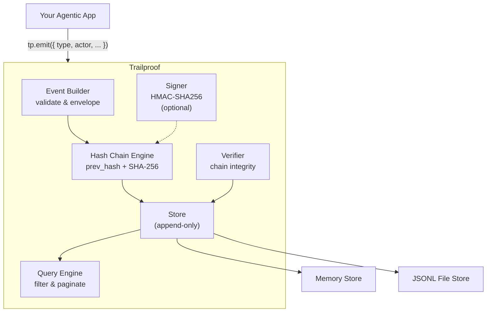

# TrailProof

> Tamper-evident audit trail for AI agents and multi-tenant applications.

[](https://pypi.org/project/trailproof/)
[](https://www.npmjs.com/package/@kyberonai/trailproof)
[](LICENSE)
[](https://github.com/KyberonAi/trailproof/actions/workflows/ci.yml)

Trailproof records events in a cryptographic hash chain. Every event commits to all
events before it. Tamper anything — you break the chain. Verify any time.

## Architecture



## What It Does

- **Hash chain integrity** — SHA-256 chain links every event to the previous one
- **Optional HMAC signing** — proves events were created by the holder of a secret key
- **Dual SDK** — identical Python and TypeScript APIs with shared test vectors
- **Two stores** — in-memory (default) or append-only JSONL file
- **Query and pagination** — filter by event type, actor, tenant, time range, trace

## Install

**Python**

```bash
pip install trailproof
# or
uv add trailproof
```

**TypeScript / Node.js**

```bash
npm install @kyberonai/trailproof
```

## Quickstart

### Python

```python
from trailproof import Trailproof

tp = Trailproof()

# Emit an event
event = tp.emit(
    event_type="myapp.user.login",
    actor_id="user-42",
    tenant_id="acme-corp",
    payload={"ip": "1.2.3.4", "method": "oauth"},
)

# Query events
result = tp.query(actor_id="user-42", limit=50)
print(result.events)   # list[TrailEvent]

# Verify chain integrity
verification = tp.verify()
print(verification.intact)   # True
print(verification.total)    # 1
print(verification.broken)   # []
```

### TypeScript

```typescript
import { Trailproof } from "@kyberonai/trailproof";

const tp = new Trailproof();

// Emit an event
const event = tp.emit({
  eventType: "myapp.user.login",
  actorId: "user-42",
  tenantId: "acme-corp",
  payload: { ip: "1.2.3.4", method: "oauth" },
});

// Query events
const result = tp.query({ actorId: "user-42", limit: 50 });

// Verify chain integrity
const verification = tp.verify();
console.log(verification.intact); // true
```

## Features

| Feature | Description |
|---------|-------------|
| Hash chain | SHA-256 links each event to the previous; genesis hash is `"0" x 64` |
| HMAC signing | Optional `hmac-sha256:<hex>` provenance signature |
| In-memory store | Default; events lost on exit; good for testing |
| JSONL file store | Append-only; survives restarts; human-readable with `jq` |
| Query | Filter by event type, actor, tenant, trace, session, time range |
| Pagination | Cursor-based; `next_cursor` for large result sets |
| Verify | Walk chain; returns `broken: [index, ...]` for tampered events |
| Get trace | All events for a `trace_id`, ordered by time |
| Zero deps | stdlib only (Python); Node.js built-ins only (TypeScript) |

## API

Both SDKs expose the same five methods:

| Method | Python | TypeScript | Returns |
|--------|--------|------------|---------|
| Emit event | `tp.emit(event_type, actor_id, ...)` | `tp.emit({ eventType, actorId, ... })` | `TrailEvent` |
| Query events | `tp.query(event_type, actor_id, ...)` | `tp.query({ eventType, actorId, ... })` | `QueryResult` |
| Verify chain | `tp.verify()` | `tp.verify()` | `VerifyResult` |
| Get by trace | `tp.get_trace(trace_id)` | `tp.getTrace(traceId)` | `TrailEvent[]` |
| Flush to disk | `tp.flush()` | `tp.flush()` | `void` |

## Configuration

**Python**

```python
from trailproof import Trailproof

# In-memory (default)
tp = Trailproof()

# JSONL file persistence
tp = Trailproof(store="jsonl", path="events.jsonl")

# HMAC signing
tp = Trailproof(signing_key="your-secret")

# Default tenant applied to every event
tp = Trailproof(default_tenant_id="acme-corp")

# All options combined
tp = Trailproof(
    store="jsonl",
    path=".trailproof/events.jsonl",
    signing_key="your-secret",
    default_tenant_id="acme-corp",
)
```

**TypeScript**

```typescript
import { Trailproof } from "@kyberonai/trailproof";

// In-memory (default)
const tp = new Trailproof();

// JSONL file persistence
const tp = new Trailproof({ store: "jsonl", path: "events.jsonl" });

// HMAC signing
const tp = new Trailproof({ signingKey: "your-secret" });

// Default tenant
const tp = new Trailproof({ defaultTenantId: "acme-corp" });
```

## Releasing

> For maintainers only.

1. Update version in `python/pyproject.toml`
2. Update version in `typescript/package.json`
3. Regenerate changelog: `git-cliff -o CHANGELOG.md`
4. Commit: `git commit -m "chore: bump version to vX.Y.Z"`
5. Tag: `git tag vX.Y.Z`
6. Push: `git push origin main --tags`
7. Approve the `release` environment in GitHub Actions

Both `publish-python.yml` and `publish-npm.yml` trigger on `v*` tags and require manual approval.

## Links

- [Specification](SPEC.md)
- [Changelog](CHANGELOG.md)
- [MIT License](LICENSE)
